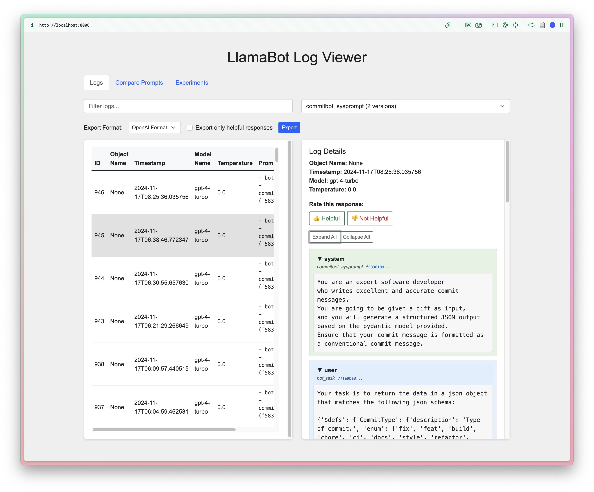
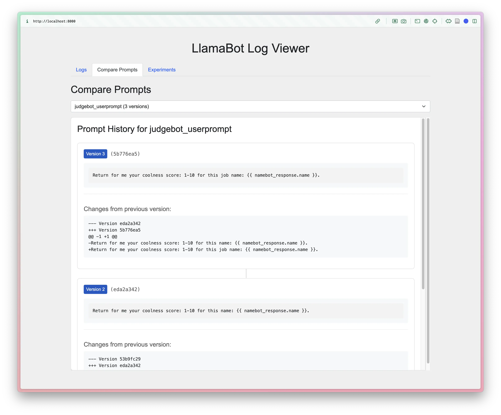
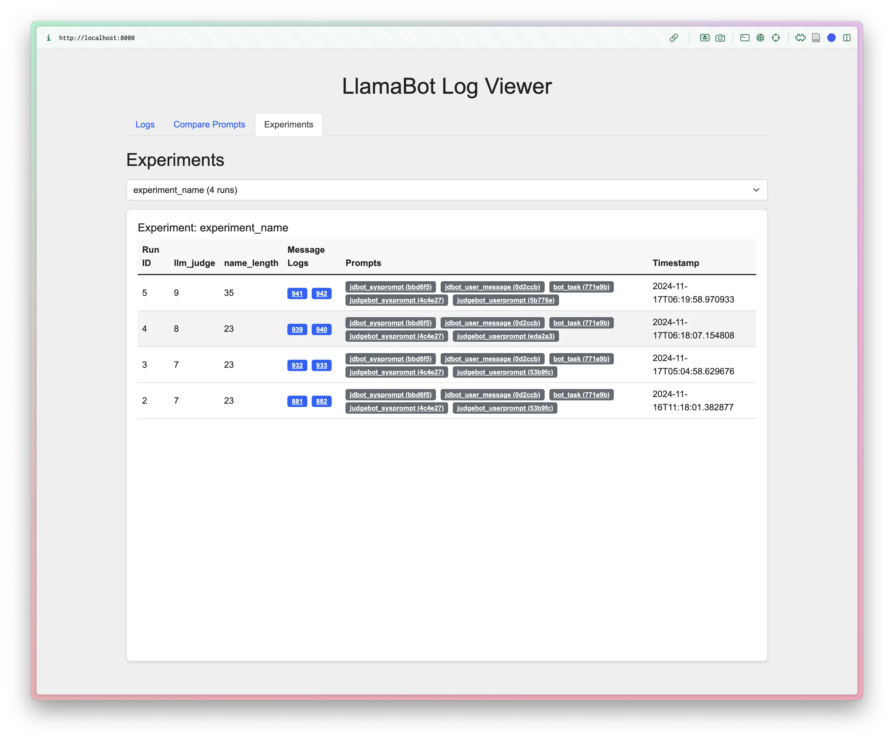

---
intents:
- Provide a diataxis-style tutorial on how to launch the LlamaBot log viewer and use
  it.
- The command for launching the log-viewer is `llamabot log-viewer launch`.
  Note the default host and port is `0.0.0.0:8000`.
- Emphasize that it is entirely local. No data is sent to the cloud. State the two
  locations where data could be stored.
- Note the special behaviour of automatically adding `message_log.db` to `.gitignore`
  so that you never accidentally commit it into source control, preserving privacy.
- There are three tables -- `experiments`, `message_log`, and `prompts`.
- You can see the schemas in the `ExperimentRun`, `MessageLog`, and `Runs` classes.
- For each of the three tables, show:
  - How the user can view message logs and interact with them. Screenshot is located
    at `docs/cli/logs.webp`.
  - How the user can view prompt versions. Screenshot is located at `docs/cli/prompt-versions.webp`.
  - How the user can view experiments. Screenshot is located at `docs/cli/experiments.webp`.
linked_files:
- llamabot/web/app.py
- llamabot/web/routers/logs.py
- llamabot/web/routers/experiments.py
- llamabot/experiments.py
- llamabot/recorder.py
---

# LlamaBot Log Viewer Tutorial

Welcome to the LlamaBot Log Viewer tutorial.
This guide will walk you through launching and using the LlamaBot log viewer,
with an emphasis on its local nature
and providing insights into the data storage and interaction capabilities.

## Overview

The LlamaBot log viewer is a local tool
designed to help you visualize and interact with your prompt and message logs.
It ensures that no data is sent to the cloud,
maintaining your privacy and data security.
The data is stored locally in two potential locations:

1. The root directory of your git repository as `message_log.db`.
2. The home directory under `.llamabot/message_log.db` if not working in a git repository.

Note that `message_log.db` stored within a repo are automatically added to `.gitignore`
so that it does not get committed to source control.
This is to ensure that your logs remain private and secure.

## Launching the Log Viewer

To launch the LlamaBot log viewer, ensure you have the necessary environment set up and run the following command:

```bash
llamabot log-viewer launch
```

This will start a local FastAPI server,
allowing you to access the log viewer through your web browser.
The default host and port is `0.0.0.0:8000`.

## Data Tables

The log viewer interacts with three main tables:

- **Experiments**
- **Message Log**
- **Prompts**

These tables are defined in the `ExperimentRun`, `MessageLog`, and `Runs` classes, respectively.

## Viewing and Interacting with Logs

### Message Logs

The `message_log` table stores detailed records of message exchanges. You can view and interact with these logs through the log viewer interface.



- **Viewing Logs**: Access the logs by navigating to the logs section. You can filter logs by function name or text content.
- **Interacting with Logs**: Expand or collapse log details, and rate logs as helpful or not.

### Prompt Versions

The `prompts` table maintains a version-controlled record of prompt templates. This allows you to track changes and view different versions of prompts.



- **Viewing Prompt Versions**: Navigate to the prompt versions section to see a list of all stored prompts and their versions.

### Experiments

The `experiments` table records experiment runs, including metadata and metrics. This helps in tracking and comparing different experiment outcomes, particularly useful when you are tweaking your prompts.



- **Viewing Experiments**: Access the experiments section to view details of each experiment, including metrics and associated message logs.

## Conclusion

The LlamaBot log viewer is a powerful tool
for managing and analyzing your prompt and message logs locally.
By following this tutorial,
you should be able to effectively launch
and use the log viewer to gain insights into your data.
