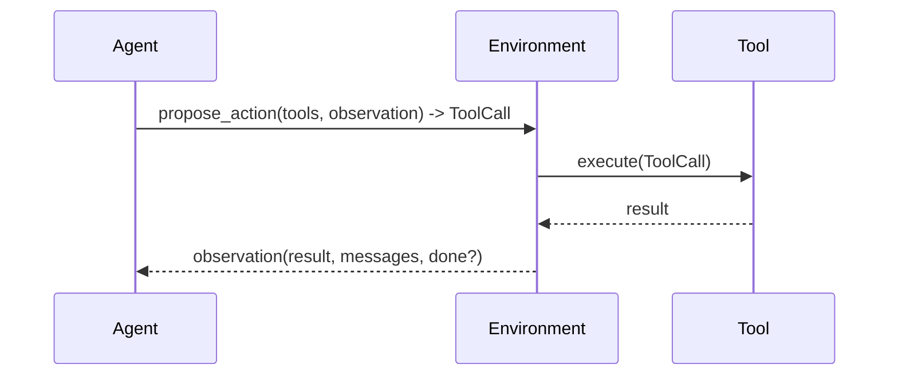
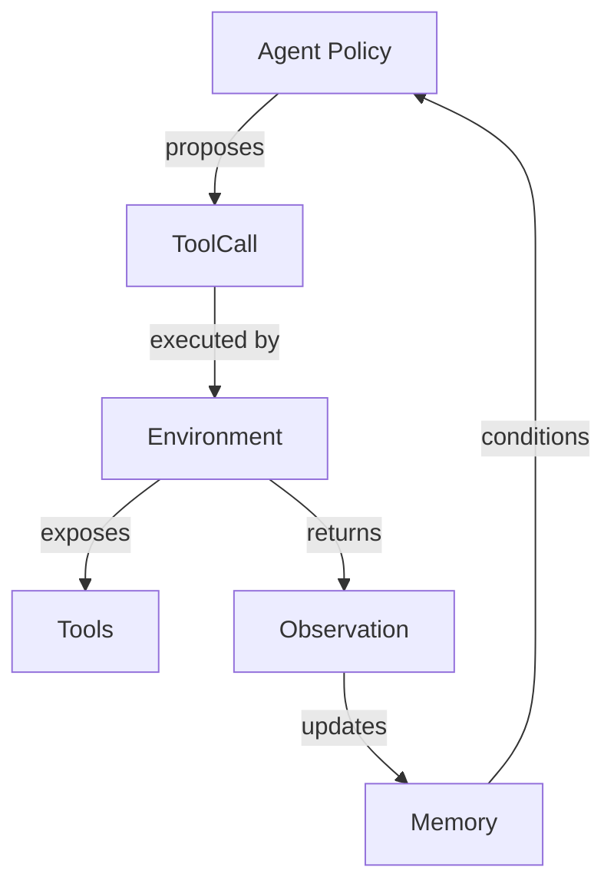

## Decoupling Execution and Agent Environments

### Context and Motivation

Agent behavior today intermingles two concerns:

- **Agent policy**: choosing the next tool (and arguments) given history.
- **Execution environment**: actually running tools, tracking state, and producing observations back to the agent.

Conflating these concerns limits portability, observability, and composability. This document proposes a clean separation: the agent selects actions; the environment executes them. This mirrors Claude Code’s terminal-as-environment pattern and aligns with MCP-style tool definitions.

### Goals

- **Modular environments**: swap execution contexts (shell, web search, writing room, code exec) without altering agent policy.
- **Stable agent interface**: a single way for agents to propose tool calls and receive observations.
- **First-class tools**: tools belong to environments; environments expose tools dynamically.
- **Recordable interactions**: every step (action, observation, tool I/O) is capturable by existing logging/recorder.
- **Simple memory**: support linear chat memory by default; allow richer memory later without changing interfaces.

### Non-goals

- Reinforcement learning algorithms or training loops.
- Orchestrating multi-agent collaboration (can be built on this layer later).
- Full MCP server implementation (but we align with its concepts).

### Key Concepts

- **Agent**: a policy that proposes a next action (tool name + JSON arguments) given current observation, tool specs, and memory.
- **Environment**: owns tools and state; executes actions; returns observations (and optionally `done`, `info`).
- **Tool**: a named, described callable with a JSON-serializable parameter schema and JSON-serializable result.
- **Observation**: what the agent perceives after an action. Contains tool results, messages, errors, and environment signals.
- **Episode/Step**: one loop iteration: observation → action → environment execution → new observation.

### Architecture Overview





### Interfaces (proposed)

#### Tool definition

Tools are environment-owned. Use a standardized, JSON-schema-like spec aligned with OpenAI function calling and MCP tools.

```json
{
  "name": "run_command",
  "description": "Execute a shell command in the current working directory.",
  "parameters": {
    "type": "object",
    "properties": {
      "command": {"type": "string", "description": "Command to execute"},
      "timeout_s": {"type": "number", "minimum": 0, "default": 60}
    },
    "required": ["command"]
  }
}
```

Note: In this codebase, tool specs are generated via LiteLLM’s helper `litellm.utils.function_to_dict`, exposed through our `@tool` decorator in `llamabot/components/tools.py`. Environments should use the decorator-wrapped functions’ `json_schema` attribute (e.g., `[f.json_schema for f in tools]`) to populate `available_tools()`.

Notes:

- The agent never executes tools; it only returns a `ToolCall`.
- The environment never decides; it exposes tools and executes calls.
- Memory is linear by default (`List[Dict]` of messages/steps).

### Terminology: why “observation” instead of “result”

- **Observation is the env→agent envelope**: It’s the canonical payload the environment provides after `reset` and each `step`. This mirrors RL interfaces where the agent receives an observation of the environment’s state.
- **Result is tool-scoped**: Each tool’s output is a “result” (e.g., `tool_result`) nested inside the observation envelope. Calling the whole envelope a “result” causes ambiguity with per-tool results.
- **Reset returns an initial observation**: Returning an explicit first observation signals readiness, encodes initial state (cwd, budgets, limits), and improves determinism and testability. Using `None` pushes probing and special-casing into the agent.

### Control Loop (owned by the Environment)

Execution is async-only with support for parallel tool calls. The Agent only proposes actions; the Environment runs the async loop.

#### Async control loop (parallel-capable)

Requirements:

- Environment exposes async variants: `reset_async()` and `step_async(action)` that return awaitables.
- Agent may return one or many actions per turn (e.g., `propose_actions(...) -> list[ToolCall]`).
- Each action and observation includes a `call_id` to correlate results.
- Memory is event-sourced (multiple observations per episode, possibly out-of-order completion).

Sketch:

```python
import asyncio
from datetime import datetime


class Environment:
    async def run_episode_async(self, agent, memory: list, max_steps: int = 100):
        tools = self.available_tools()
        observation = await self.reset_async()
        inflight: dict[str, asyncio.Task] = {}

    step = 0
        while step < max_steps:
            # Ask policy for up to available capacity worth of actions
            # Environment owns concurrency; expose as a property or internal semaphore
            capacity = max(0, getattr(self, "max_concurrency", 4) - len(inflight))
            if capacity > 0:
                actions = await agent.propose_actions(observation, tools, memory, budget=capacity)
                for action in actions:
                    task = asyncio.create_task(self.step_async(action))
                    inflight[action["call_id"]] = task
                    memory.append({
                        "event": "action_dispatched",
                        "action": action,
                        "timestamp": datetime.utcnow().isoformat(),
                    })

            if not inflight:
                break

            done, pending = await asyncio.wait(inflight.values(), return_when=asyncio.FIRST_COMPLETED)

            # Collect finished observations; more than one may complete at once
            for task in done:
                obs = task.result()
                memory.append({
                    "event": "observation",
                    "observation": obs,
                    "call_id": obs.get("call_id"),
                    "timestamp": datetime.utcnow().isoformat(),
                })
                if obs.get("done"):
                    return memory

            # Keep only pending tasks
            inflight = {cid: t for cid, t in inflight.items() if t in pending}
            step += 1

        return memory
```

This design supports: (a) asynchronous tool execution, (b) parallel in-flight calls, and (c) multiple observations per episode with proper correlation.

Parallel execution points:
- Task dispatch: `asyncio.create_task(self.step_async(action))` for each action.
- Concurrency coordination: `asyncio.wait(..., return_when=asyncio.FIRST_COMPLETED)` to collect whichever finishes first.

Concurrency control: The Environment should enforce concurrency internally (e.g., via an `asyncio.Semaphore` or a `max_concurrency` property). Avoid passing a `max_inflight` argument from the caller; the environment knows its own safe limits (API quotas, IO contention) and should apply backpressure accordingly.

### Finalization semantics

- Provide a dedicated finalization tool, e.g., `final_answer(message: str, metadata: dict | None)`.
- We can alias this to the existing `respond_to_user` tool in `llamabot/components/tools.py` so the agent calls it to end an episode.
- Environment behavior on executing the finalization tool:
  - Set `done: true` in the returned observation.
  - Emit a `final` event in memory with `message` and optional `metadata`.
  - In async/parallel mode, cancel any in-flight actions and drain tasks safely.
- The environment may also set `done: true` without the final tool for budget/timeouts/errors, including a `reason` in `info`.

Example internal concurrency guard:

```python
import asyncio


class Environment:
    def __init__(self, max_concurrency: int = 4):
        self.max_concurrency = max_concurrency
        self._sem = asyncio.Semaphore(max_concurrency)

    async def step_async(self, action):
        async with self._sem:  # enforce per-environment concurrency
            return await self._execute_tool_async(action)

    async def _execute_tool_async(self, action):
        # resolve tool, run it, normalize into an observation
        ...
```

### Environment Examples

#### 1) Shell environment (Claude Code-like)

- Tools: `run_command`, `read_file`, `write_file`, `list_dir`.
- State: current working directory, file system, environment variables.
- Observations include stdout/stderr, exit codes, and file diffs.

#### 2) Web search environment

- Tools: `search(query)`, `fetch(url)`, `extract(selectors)`.
- State: request budget, rate limiting, cached pages.

#### 3) Writing room environment

- Tools: `open_doc`, `write_section`, `format`, `export`.
- State: working document(s), outline, style settings.

#### 4) In-memory Python execution environment

- Tools: `define_function(source)`, `call_function(name, args)`, `eval(code)`.
- Supports injecting source code at runtime; can back with a temp module or an isolated `exec` namespace.

### Memory and Logging

- Use a simple event-sourced log (linear list of events) backed by existing `docs/modules/chat_memory.md` concepts and `llamabot/components/chat_memory/`.
- Event types include: `action_dispatched`, `observation`, `error`, `final`.
- Each event SHOULD include: `call_id` (if applicable), `timestamp`, and enough context to reconstruct the episode.
- Multiple observations per episode are expected (parallelism). Correlate observations to actions via `call_id`.
- Pipe events to the recorder/log viewer; environments can enrich `info` with state, diffs, metrics.

### Error semantics (recommended)

Policy: tools raise; environments normalize.

- Tools SHOULD raise exceptions when they fail (including timeouts, validation errors, IO errors). They should not format errors themselves.
- The Environment MUST catch tool exceptions inside `step`/`step_async` and normalize them into the observation:
  - Put details under a reserved `error` object; set `tool_result`/`data` to `null`.
  - Emit an `error` event in memory alongside the observation.
  - Do not crash the episode loop; allow other in-flight tasks to finish (async).

Recommended error payload shape:

```json
{
  "event": "observation",
  "call_id": "...",
  "done": false,
  "error": {
    "type": "TimeoutError",
    "message": "execution exceeded 30s",
    "retryable": true,
    "suggested_action": "increase timeout or reduce input size",
    "details": { "timeout_s": 30 }
  },
  "tool_result": null,
  "info": {}
}
```

Guidelines:

- Fatal vs non-fatal: The Environment decides. For fatal conditions (hard budget exceeded, permission denied), set `done: true` and include `info.reason`.
- Mask or truncate stack traces by default; include verbose traces only in a debug/development mode.
- Keep `error.type` stable and machine-readable (e.g., `TimeoutError`, `ValidationError`, `PermissionError`).
- Surface retryability and a brief `suggested_action` to help agent policies recover.

### Observation schema: options and examples

Two practical approaches:

1) Standard envelope with reserved keys (recommended)

- Observation is a stable envelope; environment-specific payload lives under `tool_result` or `data`.
- Reserved keys: `event`, `call_id`, `done`, `error`, `messages`, `info`, and one payload key (`tool_result` or `data`).

Example (Shell environment, envelope + tool_result):

```json
{
  "event": "observation",
  "call_id": "e7c0...",
  "done": false,
  "error": null,
  "messages": [],
  "tool_result": { "stdout": "...", "stderr": "", "status": 0 },
  "info": { "cwd": "/workspace/project" }
}
```

Example (Web environment, envelope + data):

```json
{
  "event": "observation",
  "call_id": "5b2a...",
  "done": false,
  "error": null,
  "messages": [],
  "data": {
    "search_results": [{"title": "...", "url": "..."}],
    "budget_remaining": 12
  },
  "info": { "provider": "ddg" }
}
```

2) Environment-specific top-level shape with a few reserved keys

- Keep a small set of reserved top-level keys; allow env-specific fields at the top-level.
- Reserved keys: `event`, `call_id`, `done`, `error`, `info`.

Example (Writing room environment):

```json
{
  "event": "observation",
  "call_id": "a1d4...",
  "done": false,
  "error": null,
  "doc_id": "draft-42",
  "outline": ["Intro", "Methods", "Results"],
  "cursor_position": 1280,
  "info": { "style": "short-form" }
}
```

Trade-offs:

- Standard envelope simplifies logging, testing, and policy prompts; payload collisions are avoided by putting env-specific content under `tool_result`/`data`.
- Top-level env-specific fields reduce nesting but risk name collisions and require stricter key governance.

### Alignment with MCP

- Tool spec mirrors MCP (name, description, JSON schema parameters).
- Environment owns tools; agent is a policy. This matches MCP’s separation between tool providers and model policies.
- Future: environments could be backed by MCP servers; locally we provide a lightweight in-process equivalent.

### Migration Plan (from current `agentbot`)

1. **Extract policy**: Move tool-selection logic from `agentbot.__call__` into `AgentPolicy` (callable/class) that returns `ToolCall`.
2. **Introduce environments**: Create `Environment` base and concrete envs (start with Shell and Minimal No-op env) under `llamabot/components/environments.py` (or a new `environments/` package).
3. **Move loop into Environment**: Refactor the while loop out of `agentbot` into Environment methods (`run_episode`, `run_episode_async`). CLIs/web call these Environment methods directly.
4. **Observability**: Pipe steps to the existing recorder; update log viewer to show environment, tools, actions, and observations.

### Testing Strategy

- **Unit tests (policy)**: Given a fixed observation and tool list, the policy returns a valid `ToolCall` (no execution).
- **Unit tests (env)**: Each environment’s tools execute deterministically on small fixtures; assert observations.
- **Contract tests**: Tool spec is JSON-serializable; env `available_tools()` returns well-formed specs; `step()` handles errors.
- **Integration tests**: Run a short episode using a mock or sandboxed environment; verify memory/logs capture steps.
- **Fixtures**: Provide fake tools and a dummy environment for fast tests.

### Security and Safety

- Sandboxing for shell and code execution (temp dirs, allow-lists, resource/time limits).
- Clear side-effect boundaries (tools must document side effects; env can preview/confirm when appropriate).
- Quotas and budgets enforced in environment state (e.g., API rate limits, token budgets).

### Open Questions


- How to compose multi-environment episodes (e.g., move from Web to Writing Room) while preserving memory continuity.

### Next Steps

- Draft `Environment` and `AgentPolicy` protocols and a minimal Shell environment.
- Carve policy code out of `agentbot` and implement the compatibility wrapper.
- Add tests per the strategy above; wire recorder into the orchestrator.
- Iterate with real tasks and refine observation/ToolCall shapes.


### Environment skeleton (sketch)

```python
import asyncio
import json
from datetime import datetime
from typing import Any


class Environment:
    def __init__(self, name: str, tools: list[callable], max_concurrency: int = 4):
        self.name = name
        self._tools = tools
        self._name_to_tool = {f.__name__: f for f in tools}
        self._tools_schema = [f.json_schema for f in tools]
        self.max_concurrency = max_concurrency

    # Tool surface
    def available_tools(self) -> list[dict[str, Any]]:
        return self._tools_schema

    # Episode lifecycle (async-only)
    async def reset_async(self) -> dict[str, Any]:
        return {
            "event": "observation",
            "call_id": None,
            "done": False,
            "error": None,
            "messages": [],
            "info": {"environment": self.name, "timestamp": datetime.utcnow().isoformat()},
        }

    # One step of execution (async)
    async def step_async(self, action: dict[str, Any]) -> dict[str, Any]:
        tool_name: str = action["tool_name"]
        args: dict[str, Any] = action.get("arguments", {})
        call_id: str | None = action.get("call_id")

        func = self._name_to_tool.get(tool_name)
        if func is None:
            return {
                "event": "observation",
                "call_id": call_id,
                "done": False,
                "error": {
                    "type": "ToolNotFound",
                    "message": f"Unknown tool: {tool_name}",
                    "retryable": False,
                },
                "tool_result": None,
                "info": {},
            }

        try:
            # If tools are sync, run in thread; override per-env to use native async tools
            if asyncio.iscoroutinefunction(func):
                result = await func(**args)
            else:
                result = await asyncio.to_thread(func, **args)
            obs = {
                "event": "observation",
                "call_id": call_id,
                "done": False,
                "error": None,
                "tool_result": result,
                "info": {},
            }
            if tool_name in {"final_answer", "respond_to_user"}:
                obs["done"] = True
                obs["event"] = "final"
            return obs
        except Exception as e:  # normalize per Error semantics
            return {
                "event": "observation",
                "call_id": call_id,
                "done": False,
                "error": {
                    "type": type(e).__name__,
                    "message": str(e),
                    "retryable": False,
                },
                "tool_result": None,
                "info": {},
            }

    # Async/parallel episode loop
    async def run_episode_async(self, agent, memory: list[dict[str, Any]], max_steps: int = 100) -> list[dict[str, Any]]:
        tools = self.available_tools()
        observation = await self.reset_async()
        inflight: dict[str, asyncio.Task] = {}
        step = 0

        while step < max_steps:
            capacity = max(0, self.max_concurrency - len(inflight))
            if capacity > 0:
                actions = await agent.propose_actions(observation, tools, memory, budget=capacity)
                for action in actions:
                    # PARALLEL DISPATCH: each action becomes its own task
                    task = asyncio.create_task(self.step_async(action))
                    inflight[action["call_id"]] = task
                    memory.append({"event": "action_dispatched", "action": action, "timestamp": datetime.utcnow().isoformat()})

            if not inflight:
                break

            # PARALLEL COLLECTION: wait for any to finish, then process
            done, pending = await asyncio.wait(inflight.values(), return_when=asyncio.FIRST_COMPLETED)
            for task in done:
                obs = task.result()
                memory.append({"event": "observation", "observation": obs, "call_id": obs.get("call_id"), "timestamp": datetime.utcnow().isoformat()})
                if obs.get("event") == "final" or obs.get("done"):
                    # optional: cancel/await remaining tasks here
                    return memory

            inflight = {cid: t for cid, t in inflight.items() if t in pending}
            step += 1

        return memory
```
