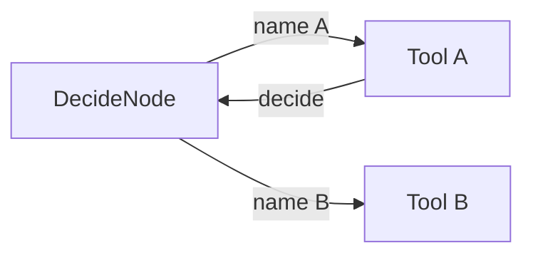

# AgentBot reference PocketFlow graph — Low-Level Design

**Created**: 2026-03-28

**Last updated**: 2026-03-28 — `DecideNode.aexec` constructs `AsyncToolBot` and awaits `AsyncToolBot.__call__` (removed `ToolBot.acall`).

**HLD Link**: [../../high-level-design.md](../../high-level-design.md)

## Requirements (EARS)

Testable requirements for this feature live in:

- [reference-graph-EARS.md](./reference-graph-EARS.md) — graph topology, decision step (`ToolBot` vs `AsyncToolBot`), async variant.

## Overview

`AgentBot` is the **reference implementation** of one specific PocketFlow graph: a **decision node** chooses a tool name, **tool nodes** run `@tool` functions, and **loopback edges** return non-terminal tools to the decision node. This LLD is the canonical technical description of that graph; it is not the only valid agent graph in LlamaBot.

## Context

- **PocketFlow** supplies `Flow` / `AsyncFlow`, `Node` / `AsyncNode`, and action-labeled edges.
- **Routing** is implemented by `DecideNode`, which uses **`ToolBot`** in `exec` and **`AsyncToolBot`** in `aexec` to map `shared["memory"]` to a single tool call per decision step.
- **Execution** uses `@tool`-wrapped **FuncNode** instances, not additional bot classes.

## Graph topology

| Element | Description |
| ------- | ----------- |
| `start` | `DecideNode` |
| `DecideNode → tool_name → FuncNode` | One edge per registered tool; `tool_name` is the function name (or equivalent). |
| `FuncNode → loopback_name → DecideNode` | Non-terminal tools (e.g. `loopback_name="decide"`). |
| Terminal tools | `loopback_name is None`; flow ends; `shared["result"]` set by terminal tool policy. |

The built graph includes **default tools** plus user tools; each decision only **activates one** outgoing edge.

## Data models

### Shared state (`shared` dict)

| Key | Type | Description |
| --- | ---- | ----------- |
| `memory` | `list[str]` | User lines, “Chosen Tool: …”, tool outputs. |
| `func_call` | `dict` | Keyword args for the next tool; set by `DecideNode`, consumed by `FuncNode`. |
| `globals_dict` | `dict` | Optional merged notebook/caller globals for tools. |
| `iteration_count` | `int` | Incremented in `DecideNode.prep`; used for iteration cap. |
| `_force_terminate` | `bool` | Set when `max_iterations` exceeded; forces termination path. |
| `result` | `Any` | Final result from terminal tool (when applicable). |
| `trace_id` | `str` | Optional span/trace correlation. |

### Routing output of `DecideNode.exec` / `aexec`

Returns the **string name** of the next tool; `prep_res["func_call"]` holds parsed JSON arguments for that tool.

## Interfaces

| Component | Module | Responsibility |
| --------- | ------ | ---------------- |
| `AgentBot` | `llamabot.bot.agentbot` | Build `Flow`, wire edges, `flow.run(shared)`. |
| `AsyncAgentBot` | `llamabot.bot.async_agentbot` | Same graph with `AsyncFlow` / `arun`; decision uses `AsyncToolBot.__call__`. |
| `DecideNode` | `llamabot.components.pocketflow.nodes` | `prep` / `exec` / `post`; `exec` invokes `ToolBot`, `aexec` invokes `AsyncToolBot`. |
| `ToolBot` | `llamabot.bot.toolbot` | Sync single-turn tool-calling LLM; routing in `DecideNode.exec`. |
| `AsyncToolBot` | `llamabot.bot.toolbot` | Async `__call__` (`acompletion`); routing in `DecideNode.aexec`. |
| `FuncNode` | `llamabot.components.pocketflow.nodes` | Run tool function; update `memory`; return loopback action or `None`. |

## API contracts (public surface)

| Entry | Contract |
| ----- | -------- |
| `AgentBot(tools=[...], ...)` | User tools must be `@tool` decorated; merged with `DEFAULT_TOOLS`. |
| `AgentBot.__call__(query, globals_dict=None)` | Appends `query` to `memory`, runs flow, returns `shared.get("result")` (terminal). |
| `AsyncAgentBot.arun(query, globals_dict=None)` | Async run; same shared contract. |
| Custom `decide_node` | Must be a PocketFlow `Node` with compatible `prep/exec/post` and routing names matching tool edges. |

## Error handling

| Condition | Behavior |
| --------- | -------- |
| Model returns no tool calls (sync or async routing) | `ValueError` from `DecideNode` (with model-specific hints). |
| Invalid JSON in tool arguments | `ValueError` from `DecideNode`. |
| `max_iterations` exceeded | Force `respond_to_user` when that tool exists; else `RuntimeError`. |

## Edge cases

1. **Multiple tool calls from model** — Only the **first** tool call is used; rest ignored (sequential graph).
2. **Ollama** — `tool_choice` may be `auto`; system prompt augmented to require tools.
3. **Custom `decide_node`** — `AgentBot` still wires `tool_node` edges; routing names must match.

## Dependencies

- **PocketFlow**: graph execution.
- **LiteLLM**: completions via `SimpleBot` / `ToolBot` / `AsyncToolBot` / other async bots.
- **`DEFAULT_TOOLS`**: baseline tools (e.g. `respond_to_user`) for the reference graph.

## Traceability (intent → code)

| EARS ID | Code location |
| ------- | ------------- |
| AGT-GRAPH-010, 020, 021 | `DecideNode._exec_decision` / `_exec_decision_async` in `llamabot/components/pocketflow/nodes.py` |
| Async routing | `AsyncToolBot.__call__` in `llamabot/bot/toolbot.py` |

## Related Documents

- [High-Level Design](../../high-level-design.md)
- [Reference graph EARS](./reference-graph-EARS.md)
- [AgentBot tutorial](../../tutorials/agentbot.md)
- [AgentBot API reference](../../reference/bots/agentbot.md)
