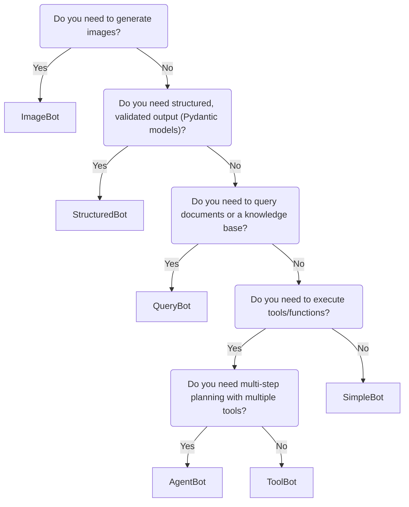

# Which Bot Should I Use?

LlamaBot provides several bot types, each optimized for different use cases. This guide helps you choose the right bot for your needs.

## Quick Decision Tree



## Bot Comparison

| Bot Type | Best For | Key Features | Memory Support |
|----------|----------|--------------|----------------|
| **SimpleBot** | General-purpose chat, prompt experimentation | Stateless or stateful conversations, simple Q&A | ChatMemory (optional) |
| **ToolBot** | Single-turn function calling, automation | Execute one tool per request, access globals | ChatMemory (optional) |
| **AgentBot** | Multi-step workflows, complex tasks | Graph-based tool orchestration, multi-turn planning | Built-in |
| **QueryBot** | Document Q&A, RAG applications | Document retrieval, semantic search | ChatMemory + DocStore |
| **StructuredBot** | Data extraction, API responses | Pydantic validation, guaranteed schema | ChatMemory (optional) |
| **ImageBot** | Image generation | DALL-E integration, image saving | None |

## Detailed Use Cases

### SimpleBot

**Use SimpleBot when:**

- You need a general-purpose chatbot
- You're experimenting with prompts
- You want stateless or simple conversational interactions
- You don't need tool execution or document retrieval

**Example scenarios:**

- Creating a chatbot that explains concepts
- Building a customer service bot
- Prompt engineering and experimentation
- Simple Q&A without external data

```python
import llamabot as lmb

bot = lmb.SimpleBot(
    system_prompt="You are a helpful assistant.",
    model_name="gpt-4o-mini"
)

response = bot("Explain quantum computing")
```

### ToolBot

**Use ToolBot when:**

- You need to execute a single function/tool per request
- You want to access global variables in your Python session
- You need automation workflows with function calling
- You're building data analysis assistants

**Example scenarios:**

- Data analysis workflows (access DataFrames, execute code)
- API integrations (call external services)
- Single-step automation tasks
- Code execution in notebooks

```python
import llamabot as lmb
from llamabot.components.tools import write_and_execute_code

bot = lmb.ToolBot(
    system_prompt="You are a data analyst.",
    model_name="gpt-4o-mini",
    tools=[write_and_execute_code(globals_dict=globals())]
)

response = bot("Calculate the mean of the sales_data DataFrame")
```

### AgentBot

**Use AgentBot when:**

- You need multi-step planning and execution
- Your task requires multiple tools working together
- You want graph-based tool orchestration
- You need complex workflows with decision-making

**Example scenarios:**

- Research assistants that search, analyze, and summarize
- Multi-step data pipelines
- Complex automation workflows
- Agents that need to plan before executing

```python
import llamabot as lmb

@lmb.tool
def search_web(query: str) -> str:
    """Search the web for information."""
    # Implementation here
    return results

@lmb.tool(loopback_name=None)
def respond_to_user(response: str) -> str:
    """Respond to the user."""
    return response

bot = lmb.AgentBot(
    tools=[search_web, respond_to_user],
    model_name="gpt-4o-mini"
)

response = bot("Research the latest developments in AI and summarize them")
```

### QueryBot

**Use QueryBot when:**

- You need to answer questions from documents
- You're building a RAG (Retrieval-Augmented Generation) application
- You have a knowledge base to query
- You need semantic search over documents

**Example scenarios:**

- Document Q&A systems
- Knowledge base assistants
- Code documentation helpers
- Internal wiki query systems

```python
import llamabot as lmb

docstore = lmb.LanceDBDocStore(table_name="my_docs")
docstore.extend([doc1, doc2, doc3])

bot = lmb.QueryBot(
    system_prompt="You are an expert on these documents.",
    docstore=docstore,
    memory=lmb.ChatMemory()
)

response = bot("What does the documentation say about authentication?")
```

### StructuredBot

**Use StructuredBot when:**

- You need guaranteed structured output
- You're extracting data from unstructured text
- You need Pydantic model validation
- You're building APIs that require specific schemas

**Example scenarios:**

- Data extraction from text
- Form processing with validation
- API response generation
- Structured data parsing

```python
import llamabot as lmb
from pydantic import BaseModel

class Person(BaseModel):
    name: str
    age: int
    email: str

bot = lmb.StructuredBot(
    system_prompt="Extract person information.",
    pydantic_model=Person,
    model_name="gpt-4o"
)

person = bot("John is 25 years old. Email: john@example.com")
# Returns validated Person object
```

### ImageBot

**Use ImageBot when:**

- You need to generate images from text prompts
- You're building creative applications
- You need DALL-E integration

**Example scenarios:**

- Image generation for content creation
- Creative AI applications
- Visual content generation

```python
import llamabot as lmb

bot = lmb.ImageBot()

image_path = bot("A painting of a sunset over mountains")
```

## Memory Options

### ChatMemory (Conversational Memory)

Available for: SimpleBot, ToolBot, StructuredBot, QueryBot

- **Linear memory**: Fast, no LLM calls

  ```python
  memory = lmb.ChatMemory()
  ```

- **Threaded memory**: Intelligent conversation threading

  ```python
  memory = lmb.ChatMemory.threaded(model="gpt-4o-mini")
  ```

### Document Store (RAG Memory)

Available for: QueryBot

- **LanceDBDocStore**: Default, fast vector search
- **BM25DocStore**: Keyword-based search

## Migration Guide

### From SimpleBot to ToolBot

If you find yourself needing to execute code or call functions:

```python
# Before: SimpleBot
bot = lmb.SimpleBot("You are a helper.")

# After: ToolBot with code execution
bot = lmb.ToolBot(
    system_prompt="You are a helper.",
    tools=[write_and_execute_code(globals_dict=globals())]
)
```

### From ToolBot to AgentBot

If you need multi-step planning instead of single-turn execution:

```python
# Before: ToolBot (single turn)
bot = lmb.ToolBot(tools=[my_tool])

# After: AgentBot (multi-turn)
@lmb.tool
def my_tool(arg: str) -> str:
    return result

bot = lmb.AgentBot(tools=[my_tool])
```

### From SimpleBot to QueryBot

If you need to query documents:

```python
# Before: SimpleBot
bot = lmb.SimpleBot("You are helpful.")

# After: QueryBot with documents
docstore = lmb.LanceDBDocStore(table_name="docs")
docstore.extend(documents)
bot = lmb.QueryBot(
    system_prompt="You are helpful.",
    docstore=docstore
)
```

## Still Not Sure?

If you're unsure which bot to use:

1. **Start with SimpleBot** - It's the most flexible and can handle most basic use cases
2. **Add memory** - If you need conversation context, add `ChatMemory`
3. **Add tools** - If you need function calling, switch to `ToolBot`
4. **Add planning** - If you need multi-step workflows, use `AgentBot`
5. **Add documents** - If you need RAG, use `QueryBot`

For most users, **SimpleBot with ChatMemory** covers 80% of use cases.
Upgrade to specialized bots only when you need their specific features.
